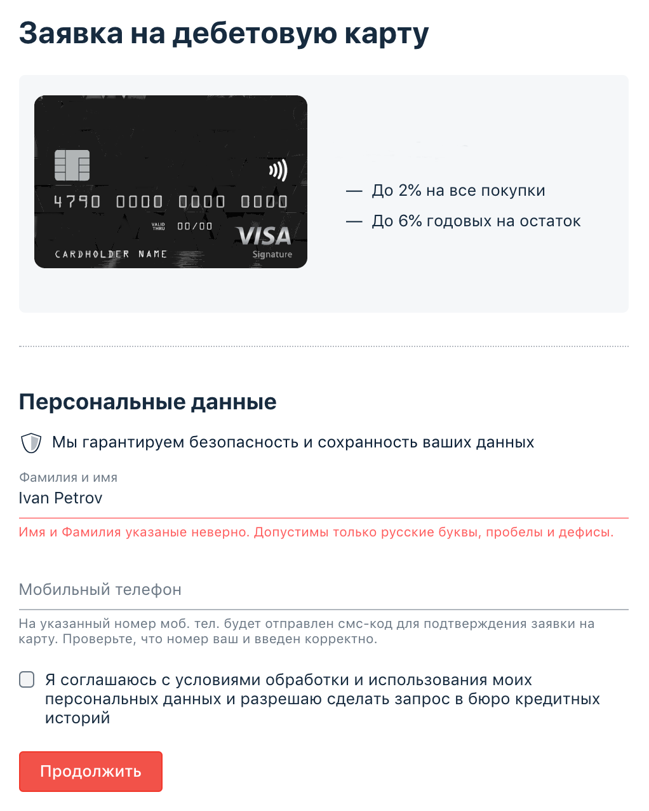

# Домашнее задание к занятию «2.1. Тестирование веб-интерфейсов»

## Решение
* <a href="https://github.com/Nephedov/4.Automated-Testing/blob/ecd41e52d1bde01bcba773ed6c395c5b7e9cef55/src/test/java/ru/netology/CardOrderTest.java">CardOrderTest.java</a> - класс с функциональными тестами отправки формы, с использованием WebDriver и Selenium.
## Что было сделано
* Настроек <a href="https://github.com/Nephedov/4.Automated-Testing/blob/578359ab648bf583c7f27889681b68f542b23f75/build.gradle">build.gradle</a> с зависимостями:
  * JunitJupier.
  * Selenide.
  * WebDriverManager.
* Подключен к проекту AppVeyor. Настроен <a href="https://github.com/Nephedov/4.Automated-Testing/blob/578359ab648bf583c7f27889681b68f542b23f75/.appveyor.yml">appveyor.yml</a>. Добавлен бейдж в README.md, о статусе сборки при пуше.
* Реализованы функциональные автотесты формы заявки карты в классе
  <a href="https://github.com/Nephedov/4.Automated-Testing/blob/ecd41e52d1bde01bcba773ed6c395c5b7e9cef55/src/test/java/ru/netology/CardOrderTest.java">CardOrderTest.java</a>.

## Задача №1: заказ карты

Вам необходимо автоматизировать тестирование формы заказа карты:

Требования к содержимому полей:
1. В поле фамилии и имени разрешены только русские буквы, дефисы и пробелы.
2. В поле телефона — только 11 цифр, символ + на первом месте.
3. Флажок согласия должен быть выставлен.

Тестируемая функциональность: отправка формы.

Условия: если все поля заполнены корректно, то вы получаете сообщение об успешно отправленной заявке:

## Задача №2: проверка валидации (необязательная)

Тестируемая функциональность: валидация полей перед отправкой.

Условия: если какое-то поле не заполнено или заполнено неверно, то при нажатии на кнопку «Продолжить» должны появляться сообщения об ошибке. Будет подсвечено только первое неправильно заполненное поле:

